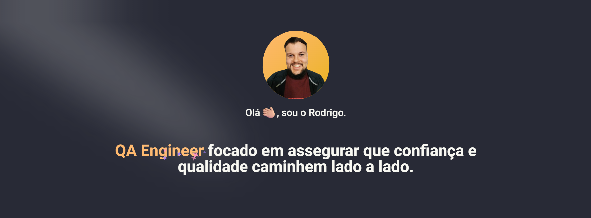

#  Portfolio!



##  Tech Stack

This project was developed using:

- [NextJS](https://nextjs.org/)
- [TailwindCSS](https://tailwindcss.com/)
- [DaisyUI](https://daisyui.com/)

##  Starting the Project

First, install all the dependencies:

```bash
npm install
```

Then, run the development server:

```bash
npm run dev
```

Open [localhost:3000](http://localhost:3000) with your browser to see the running project.

##  Bugs

If you found any bug, please, [open an issue](https://github.com/rodrigomolter/portfolio/issues/new). It's important to me.

##  Support the Project

If you want to support this project, please leave a .

<footer>
  <hr>
  <p align="center">
    Made with  by <a href="https://www.linkedin.com/in/rodrigo-molter/">Rodrigo Molter</a>.
  </p>
</footer>
